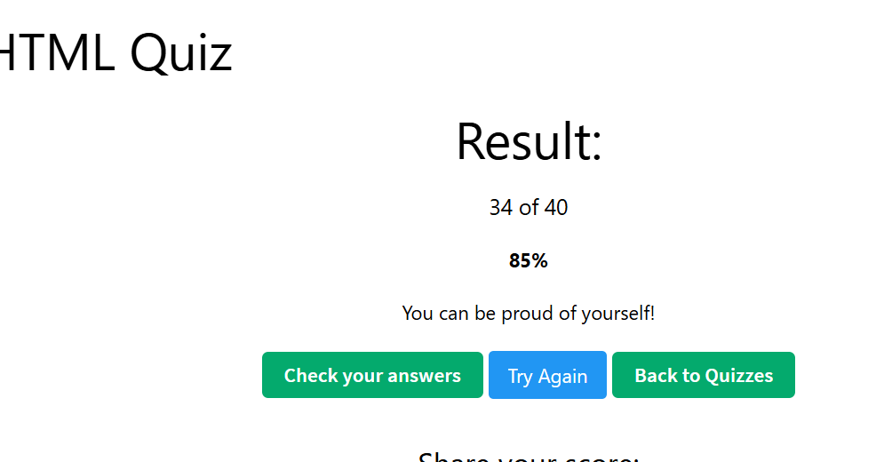

准备以下⼋股题⽬答案, 写在 note.md ⾥
1. What is HTML?
HTML (HyperText Markup Language) is the standard markup language used to create and structure web pages.
It defines the structure and content of a webpage using elements such as headings, paragraphs, links, images, forms, and tables.

2. What is the purpose of the <meta> tag?
The <meta> tag provides metadata about an HTML document.

Common uses:
Character encoding
Viewport settings
SEO information
Page description
Author information

3. What is the minimal structure of an HTML5 document?
A minimal HTML5 document includes:

- <!DOCTYPE html> declaration
- html root element
- head section for metadata
- body section for visible content

4. What is the difference between <head> and <header> ?
<head> contains metadata for the broswer
<header> a semantic HTML element used inside the page content

5. What element can we use to create a dropdown list?
<select> together with <option>

6. What is the <form> tag used for in HTML?
user can input and sumbit data to server

7. Explain the rel="noreferrer nofollow" attribute in <a> tag? How can we open
the link in a new tab?
noreferrer: prevents the browser from sending the referring page information
nofollow: tell search engines not to pass SEO ranking value to the linked page.
open a new tab: target="_blank"

8. How do you serve your page in multiple languages?
use <html lang="en">

9. What are semantic HTML tags, and why are they important?
<header>
<footer>
<nav>
<section>
<main>
because they make html better to read and mantain
helping accessibilty, use can better understand of each part
and better SEO, search engines understand content more clearly

10. What’s the difference between SVG and Canvas?
SVG is Vector-based, is the DOM elements easy to style with CSS and good for icons and charts
canvas is Pixel-based, not a part of DOM, better for games and better performance

