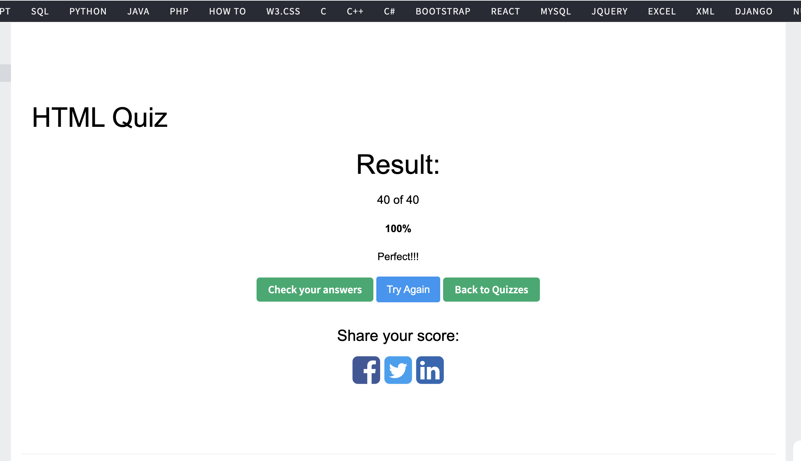

1. What is HTML?

HTML stands for HyperText Markup Language. It's a markup language — not a programming language — used to describe the structure and content of a web page.
"HyperText" means the text can contain links that jump to other pages or resources. "Markup" means we use tags to wrap content and tell the browser what each part is — like "this is a heading", "this is a paragraph", or "this is an image".
HTML is one of the three core technologies of the web: HTML for structure, CSS for styling, and JavaScript for behavior. The current version is HTML5, which added semantic tags like <header>, <nav>, <article>, and built-in support for multimedia like <video> and <audio>.

2. What is the minimal structure of an HTML5 document?

A minimal HTML5 document looks like this:
<!DOCTYPE html>
<html lang="en">
<head>
    <meta charset="UTF-8">
    <title>Page Title</title>
</head>
<body>

</body>
</html>

Breaking it down:
<!DOCTYPE html> goes on the first line and tells the browser to use HTML5 standards. Without it, the browser falls into "quirks mode" and rendering gets unpredictable.
<html lang="en"> is the root element. The lang attribute helps with SEO and screen readers.
<head> holds metadata — stuff the user doesn't see, like the charset, title, and CSS links.
<meta charset="UTF-8"> sets the character encoding so things like Chinese characters and emojis render correctly.
<title> is what shows up in the browser tab and search results.
<body> is where all the visible content goes.

3. What is the purpose of the `meta` tag?

The <meta> tag lives inside <head> and provides metadata about the page — info that users don't see, but browsers, search engines, and social platforms use.Common uses include:
Character encoding — <meta charset="UTF-8"> so text renders correctly.
Responsive design — <meta name="viewport" content="width=device-width, initial-scale=1.0"> makes the page adapt to mobile screens.
SEO — <meta name="description"> controls the snippet shown in Google search results.
Crawler control — <meta name="robots" content="noindex, nofollow"> tells search engines whether to index the page.
Social sharing — Open Graph tags like <meta property="og:title"> and og:image control how the page looks when shared on Facebook, Twitter, etc.
Basically, <meta> tags are for machines, not humans, but they're critical for SEO, mobile support, and social previews.

4. What is the difference between `<head>` and `<header>`?

They sound similar but are completely different things.
<head> is part of the document structure — it sits as a sibling of <body> and holds metadata like <title>, <meta>, and <link> tags. Users don't see it; it's for browsers and search engines. There's only one <head> per document.
<header> is a semantic HTML5 tag that lives inside <body>. It represents the top section of a page or a section — usually containing things like the logo, site title, or navigation. Users can see it, and you can have multiple <header> elements on a page (one for the page, one inside each <article>, etc.).

Quick way to remember: <head> is the document's brain (invisible, holds info), <header> is the page's forehead (visible, the top area).

5. What element can we use to create a dropdown list?

We use the <select> element with <option> elements inside it.
<select name="fruit">
    <option value="apple">Apple</option>
    <option value="banana">Banana</option>
    <option value="orange">Orange</option>
</select>

The value is what gets submitted with the form, and the text between the tags is what the user sees.
A few useful attributes:

selected on an option makes it the default
multiple on the select allows multi-selection
disabled disables an option or the whole dropdown

If you have lots of options, you can group them with <optgroup>.
Also worth mentioning: <datalist> is a related element that gives an input field a list of suggestions, but unlike <select>, the user can also type their own value.

6. What is the `<form>` tag used for in HTML?

The <form> tag is used to collect user input and submit it to a server. It's used for things like login, signup, search, comments — anything where the user fills something in and sends it off.

<form action="/submit" method="POST">
    <label for="name">Name:</label>
    <input type="text" id="name" name="name">

    <label for="email">Email:</label>
    <input type="email" id="email" name="email">

    <button type="submit">Submit</button>
</form>

The two key attributes are:

action — the URL where the data gets sent
method — the HTTP method, usually GET or POST. GET puts the data in the URL as query params (good for search), and POST puts it in the request body (good for sensitive data like passwords).

Inside a form we typically have controls like <input>, <textarea>, <select>, and <button>. One important thing to remember: only controls with a name attribute actually get submitted with the form.
If we're uploading files, we also need to set enctype="multipart/form-data".

7. Explain the `rel="noreferrer nofollow"` attribute in `<a>` tag? How can we open the link in a new tab?

To open a link in a new tab, we use target="_blank":
<a href="https://example.com"
   target="_blank"
   rel="noopener noreferrer nofollow">
   Visit Site
</a>

When we use target="_blank", it's best practice to add rel values for security and privacy:

noopener — prevents the new page from accessing the original page via window.opener. Without it, the new page could redirect your original tab to a phishing site (called a "tabnabbing" attack).
noreferrer — stops the browser from sending the Referer header, so the new page doesn't know where the user came from. It also includes the noopener behavior.
nofollow — tells search engines not to follow the link or pass SEO ranking to it. It's commonly used for user-generated content, ads, or untrusted external links. It only affects SEO, not the user experience.

Modern browsers actually apply noopener by default for target="_blank", but it's still good practice to add it explicitly for older browser support.

8. How do you serve your page in multiple languages?

To serve a page in multiple languages, we do a few things on the HTML side:

Set the lang attribute on <html> — like <html lang="en"> or <html lang="zh-CN">. This tells browsers, search engines, and screen readers what language the page is in.
Use UTF-8 encoding with <meta charset="UTF-8"> so all characters render correctly.
Use hreflang links in the <head> to tell search engines about other language versions of the page:

<link rel="alternate" hreflang="en" href="https://example.com/en/">
<link rel="alternate" hreflang="zh" href="https://example.com/zh/">
This helps Google show the right version to users based on their language.

Apply lang to specific elements when a section is in a different language than the rest of the page — useful for screen readers and spell-check.
Use dir="rtl" for right-to-left languages like Arabic or Hebrew.

In real projects, we usually also use an i18n library (like i18next or react-intl) to manage translation strings, and detect the user's language from the browser settings, URL path, or Accept-Language header.

9. What are semantic HTML tags, and why are they important?

Semantic HTML tags are tags whose names describe what the content means, not just how it looks. Instead of using 
 everywhere, we use tags like <header>, <nav>, <main>, <article>, <section>, <aside>, and <footer> — each one tells us what that part of the page is for.They matter for a few reasons:
Accessibility — screen readers rely on semantic tags to help users navigate. A <nav> is announced as navigation, a <button> is recognized as a button. If everything is just 
, users with disabilities have a much harder time.
SEO — search engines use semantic structure to understand which parts of the page are important. An <article> or <h1> carries more weight than a random 
.
Maintainability — the code tells a story. We can read the structure without checking class names, which makes teamwork and future updates easier.
Tooling support — features like browser reading mode, smart assistants, and AI tools work better when HTML is semantic.
In short, semantic tags make HTML describe what content is, not just how it looks, which benefits users, machines, and developers.

10. What’s the difference between SVG and Canvas?

Both are used to draw graphics on a web page, but they work very differently.
SVG is vector-based and built with XML. Each shape — like a circle or rectangle — is a DOM element, so we can style it with CSS, attach event listeners to individual shapes, and scale it infinitely without losing quality.
Canvas is pixel-based. It gives us a blank area and we use JavaScript to draw on it. Once something is drawn, it's just pixels — there's no DOM, no individual shapes to grab, and it gets blurry when scaled up.
Key differences:

DOM — SVG has one node per shape; Canvas is just one element no matter what we draw.
Events — SVG shapes can be clicked or hovered directly; with Canvas, we have to manually calculate coordinates.
Scaling — SVG stays sharp at any size; Canvas pixelates.
Performance — SVG slows down with lots of shapes (too many DOM nodes); Canvas handles thousands of objects much better.
Accessibility — SVG is readable by screen readers; Canvas isn't.

When to use which:

SVG is great for icons, logos, charts, and graphics that need interaction or scaling.
Canvas is better for games, heavy data visualizations, image processing, and anything with lots of objects or frequent redraws.

Quick way to remember: SVG is like Photoshop shape layers — each shape is editable. Canvas is like painting on paper — once it's down, it's pixels.

