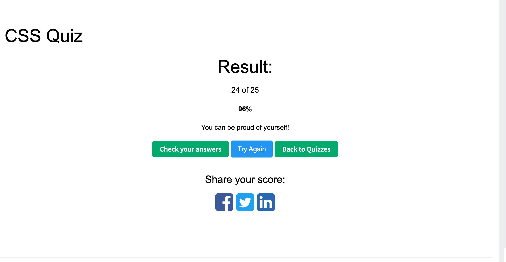

1. What is CSS?
CSS stands for Cascading Style Sheets. We use it to style web pages — things like colors, fonts, layout, and spacing. HTML gives the page its structure, and CSS controls how it looks. The "cascading" part means styles can be inherited and overridden based on specificity, so we can layer rules together to get the final design.

2. What is block element? How is it different from inline, and inline-block elements?
A block element takes up the full width of its container and starts on a new line — like 
, 
, or <h1>. We can set its width, height, margin, and padding freely.
An inline element only takes up as much space as its content, and it sits on the same line as other elements — like  or <a>. We can't set width or height on it, and vertical margin and padding don't really work.
Inline-block is kind of the best of both worlds. It flows inline with other elements, but we can still set width, height, and full margin and padding — so we often use it for things like nav items or buttons in a row.  or <button>

3. What is the difference between pseudo-class and pseudo-element?
The main difference is what they target. A pseudo-class selects an element based on its state or position — like :hover when the user hovers over it, or :first-child for the first item in a list. The element already exists; we're just selecting it in a certain state.
A pseudo-element, on the other hand, lets us style a specific part of an element, or even create a virtual element that's not in the HTML. For example, ::before and ::after let us insert content before or after an element, and ::first-letter styles just the first letter of a paragraph.
Syntactically, pseudo-classes use a single colon and pseudo-elements use double colons — that's the easiest way to tell them apart.

4. What is the difference between the child combinator and the descendant combinator?
Both are combinators that describe the relationship between elements, but they target different levels of nesting.
The descendant combinator uses a space — like div p — and it selects all 
 elements inside a 
, no matter how deeply nested they are.
The child combinator uses a greater-than sign — like div > p — and it only selects 
 elements that are direct children of the 
. Grandchildren or deeper descendants won't be matched.
So the descendant combinator is broader and the child combinator is more specific. We usually reach for the child combinator when we want tighter control — for example, styling only the top-level items in a nav menu without affecting nested dropdown items.

5. What is the attribute selector? Give some examples.
An attribute selector lets us select elements based on their HTML attributes or attribute values, using square brackets. It's really useful when we can't easily target something with just a class or ID.
There are a few common forms. The simplest is just [disabled] — that selects any element with the disabled attribute. Then we can match exact values, like input[type="text"] to style only text inputs.
There are also partial matches: [href^="https"] matches values that start with "https" — great for styling external links. [href$=".pdf"] matches values that end with ".pdf" — useful for adding a PDF icon. And [class*="btn"] matches values that contain "btn" anywhere.
A common use case is form styling — we can give different styles to input[type="email"], input[type="password"], and so on, without adding extra classes to the HTML. We also use it a lot with data-* attributes for state-based styling.

6. What are two ways that we can make an element invisible? What is the difference?
The two most common ways are display: none and visibility: hidden. They both make the element invisible, but they behave very differently in terms of layout.
With display: none, the element is completely removed from the document flow — it doesn't take up any space, and the surrounding elements shift to fill in the gap. It's like the element isn't there at all.
With visibility: hidden, the element is still there and still takes up its original space — you just can't see it. The layout stays the same, like the element is wearing an invisibility cloak.
So if we want the layout to stay stable — say, to avoid the page jumping around — we'd use visibility: hidden. If we want to fully remove it, like switching between tabs, we'd use display: none.
One more option worth mentioning is opacity: 0. It also makes the element invisible and keeps its space, but unlike the other two, the element is still clickable unless we also set pointer-events: none. It's mainly used for fade-in and fade-out animations because it supports transitions.

7. What is the CSS Box Model? Describe each part.
The CSS Box Model describes how every element on a page is rendered as a rectangular box, made up of four layers from inside out: content, padding, border, and margin.
The content is the actual content area — text or images — and its size is controlled by width and height. Padding is the space between the content and the border, kind of like inner cushioning. Border is the line around the box. And margin is the space outside the border, which separates this element from others.
One important thing to know is how the total width is calculated, and that depends on the box-sizing property. By default it's content-box, which means width only includes the content — padding and border get added on top. So a 200px wide box with 20px padding and 5px border actually takes up 250px on the screen.
But if we set box-sizing: border-box, the width includes content, padding, and border together. So width: 200px really means 200px total. Most modern projects apply border-box globally because it's way more predictable.
One more thing worth mentioning is margin collapsing — when two block elements are stacked vertically, their margins don't add up. Instead, the larger one wins. That's a common source of confusion for people new to CSS.

8. What is the usage of `!important`? What are some use cases?
`!important` is a CSS keyword we add at the end of a property value to force it to override the normal specificity rules. So even if another selector is more specific, the one with `!important` will win. It can even override inline styles, which makes it one of the strongest tools in CSS.
A few legitimate use cases: we use it to override styles from third-party libraries like Bootstrap or Ant Design when our normal selectors aren't specific enough. It's also common in utility classes — like a .hidden class that sets display: none !important; — so we can be sure it always works no matter where we apply it. And it's useful in print stylesheets or accessibility overrides where users need to force certain styles.
That said, we try to avoid !important in regular code because it breaks the natural cascade and makes the CSS really hard to maintain. Once we add `!important`, the only way to override it later is with another `!important`, and that leads to a cycle that's messy. So the general rule is: if we feel like we need `!important`, we should first check if we can solve it by writing a more specific selector or restructuring the CSS.

9. What does z-index do?
z-index controls the stacking order of elements along the Z-axis — basically, when elements overlap, it decides which one appears on top. A higher z-index means the element shows up closer to the user.
One important thing to remember is that z-index only works on positioned elements — meaning elements with position: relative, absolute, fixed, or sticky. It also works on flex or grid children. If we just set z-index on a static element, nothing happens.
The tricky part is stacking contexts. Whenever a positioned element has a z-index value other than auto, it creates its own stacking context — kind of like a separate layer. And z-index only compares elements within the same stacking context.
So a common gotcha is: if a child has z-index: 9999 but its parent has a lower z-index than another parent, the child still ends up below — because the whole parent layer is below. Properties like opacity, transform, and filter can also create new stacking contexts unexpectedly, which sometimes causes confusing bugs.
In practice, on bigger projects we usually define a set of z-index variables — like one for dropdowns, modals, tooltips — so the values stay consistent and we don't end up writing z-index: 99999 just to fight other styles.

10. Can padding and margin be negative?
margin can be negative, but padding cannot. If we set a negative padding, the browser just ignores it and treats it as zero.
The reason comes back to what these properties actually mean. padding is the inner space between the content and the border — it doesn't really make sense for that to be negative, because the content can't be "smaller than zero" inside its own box.
margin, on the other hand, is the outer space between an element and its neighbors. Negative margin just means the element moves closer to or overlaps with another element, which is totally valid.
Negative margin actually has some practical use cases. A common one is making elements overlap — like stacking cards or creating overlapping avatar groups. Another is canceling out a parent's padding so a child can stretch to the full width of its container. Before flexbox and grid, frameworks like Bootstrap used negative margins a lot to handle gutter alignment in grid systems.
One thing to keep in mind: negative margin-top or margin-left moves the element itself, but negative margin-bottom or margin-right pulls the next element toward it instead. That's sometimes a surprise when debugging layout issues.

11. How do you center a block element with CSS?
There are several ways to center a block element, and the right one depends on whether we need horizontal centering, vertical, or both.
The classic way to horizontally center a block is margin: 0 auto. We set the top and bottom margins to zero and the left and right to auto, and the browser splits the remaining space evenly. The element does need a defined width for this to work.
For both directions, the modern approach is Flexbox. We set display: flex, justify-content: center, and align-items: center on the parent, and the child gets centered both ways. The child doesn't need a fixed size, which makes it really flexible.
An even shorter option is CSS Grid — we can just write display: grid; place-items: center; on the parent and it handles both axes in a single line.
Another classic method, especially when we don't know the child's size, is absolute positioning with transform: set position: absolute, top: 50%; left: 50%, and transform: translate(-50%, -50%). That works really well for things like modals.
In real projects today, I'd reach for Flexbox or Grid most of the time — they're cleaner and more readable. The older techniques are good to know because we still see them in legacy code.

12. What are grid items? Can you explain some grid item properties?
Grid items are the direct children of a grid container — basically, once we set display: grid on a parent, all its direct children automatically become grid items. We can then use special properties on each item to control where it goes and how it looks inside the grid.
The most common ones are grid-column and grid-row, which let us define which column and row lines the item starts and ends at. For example, grid-column: 1 / 3 means it spans from column line 1 to column line 3 — so it covers two columns. We can also use the span keyword, like grid-column: span 2, when we just want to say "take up two columns" without counting lines. And there's grid-area as a shorthand that lets us set all four positions in one line.
For alignment, each item can individually control its position inside its own cell using justify-self for horizontal alignment and align-self for vertical. place-self is the shorthand that handles both — place-self: center is the quickest way to center an item in its cell.
One nice thing about grid items is that they support z-index directly without needing position. So if multiple items overlap, we can control the stacking order just by setting z-index. They also support the order property, which lets us rearrange items visually without changing the HTML.
In real projects, grid item properties are really useful for building complex layouts — like a header that spans the full width, a sidebar that takes one column, and a main content area that takes the rest. It's way cleaner than trying to do the same thing with floats or flexbox alone.

13. What is a flex container? Can you explain some flex container properties?
A flex container is the parent element where we apply display: flex. Once we do that, its direct children automatically become flex items, and we get a whole set of properties to control how they're laid out.
The most important concept to understand first is that Flexbox works along two axes — the main axis and the cross axis. By default, the main axis runs horizontally and the cross axis runs vertically, but we can flip them with flex-direction.
The main container properties I use all the time are:
flex-direction controls which way the main axis goes — row for horizontal, column for vertical.
flex-wrap decides whether items wrap to a new line when they overflow. We usually set it to wrap for responsive layouts.
justify-content aligns items along the main axis. Common values are center, space-between, and space-around.
align-items aligns items along the cross axis. The classic combo justify-content: center plus align-items: center is the easiest way to center anything both horizontally and vertically.
align-content is similar to align-items but only kicks in when we have multiple wrapped rows — it controls how those rows are distributed.
And gap sets the spacing between items, which is much cleaner than using margins on each item.
In real projects, Flexbox is great for one-dimensional layouts — like a navbar, a row of cards, or centering a single element. For more complex two-dimensional layouts, I'd reach for CSS Grid instead.

14. What is responsive web design? How do we achieve this?
Responsive web design means building a website that automatically adapts to different screen sizes and devices — so we write one codebase and it works well on phones, tablets, laptops, and large monitors.
There are a few core techniques we use to achieve this.
First is the viewport meta tag — <meta name="viewport" content="width=device-width, initial-scale=1">. This is essential, otherwise mobile browsers will render the page at desktop width and just zoom out.
Second is media queries, which let us apply different CSS rules at different screen sizes. For example, we can stack elements vertically on small screens and lay them out side-by-side on larger ones. The most common approach is mobile-first — we write the base styles for mobile, then use min-width media queries to enhance the layout for bigger screens.
Third is fluid layouts — instead of fixed pixel widths, we use relative units like percentages, rem, vw, or fr so things scale naturally. Flexbox and Grid are huge here — they handle a lot of responsive behavior on their own. A pattern I use a lot is grid-template-columns: repeat(auto-fit, minmax(250px, 1fr)) — it automatically adjusts the number of columns based on screen width, without any media queries.
Fourth is responsive images — using srcset or the <picture> element to serve different image sizes depending on the device, which saves bandwidth on mobile.
More recent additions like container queries and the clamp() function make things even more flexible. Container queries let components respond to their container's size instead of the viewport, and clamp() lets font sizes scale smoothly between a minimum and maximum value without needing breakpoints.
In practice, I usually start mobile-first, build the layout with Flexbox or Grid, and only add media queries when I really need to change the layout structure.

