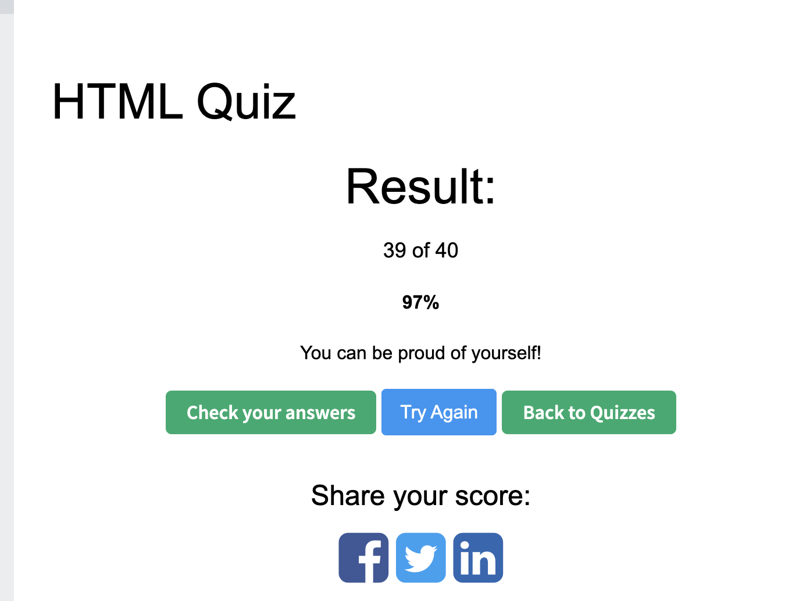

# HW2 Q & A

## CSS Quiz Result



## 1. What is CSS?

CSS stands for Cascading Style Sheets. It is used to style HTML pages, like colors, fonts, spacing, layout, and responsive design.

## 2. What is block element? How is it different from inline, and inline-block elements?

A block element starts on a new line and usually takes the full width, like `div`, `p`, and `h1`.

An inline element stays in the same line and only takes the space it needs, like `span` and `a`.

An inline-block element stays in the same line, but we can set its width and height.

## 3. What is the difference between pseudo-class and pseudo-element?

A pseudo-class selects an element in a special state, like `:hover`, `:focus`, or `:first-child`.

A pseudo-element selects or creates a specific part of an element, like `::before`, `::after`, or `::first-letter`.

## 4. What is the difference between the child combinator and the descendant combinator?

The child combinator `>` only selects direct children.

The descendant combinator with a space selects all matching elements inside, no matter how deep they are.

## 5. What is the attribute selector? Give some examples.

An attribute selector selects elements based on their attributes.

For example, `input[type="text"]` selects text inputs, `a[target="_blank"]` selects links that open in a new tab, and `[disabled]` selects disabled elements.

## 6. What are two ways that we can make an element invisible? What is the difference?

We can use `display: none` or `visibility: hidden`.

`display: none` removes the element from the page layout. `visibility: hidden` hides the element, but it still keeps its space.

## 7. What is the CSS Box Model? Describe each part.

The CSS Box Model describes how an element takes space on the page.

It has four parts: content, padding, border, and margin.

Content is the actual text or image. Padding is the space inside the border. Border wraps the padding and content. Margin is the space outside the border.

## 8. What is the usage of `!important`? What are some use cases?

`!important` gives a CSS rule very high priority.

It can be useful when we need to override third-party styles or quick temporary fixes. But we should not use it too often because it makes CSS harder to manage.

## 9. What does z-index do?

`z-index` controls which element appears on top when elements overlap.

It works on positioned elements, like elements with `position: relative`, `absolute`, `fixed`, or `sticky`.

## 10. Can padding and margin be negative?

Margin can be negative.

Padding cannot be negative. Padding is inside the element, so negative padding does not make sense in CSS.

## 11. How do you center a block element with CSS?

If the block has a fixed width, we can use `margin: 0 auto`.

For example:

```css
.box {
  width: 300px;
  margin: 0 auto;
}
```

## 12. What are grid items? Can you explain some grid item properties?

Grid items are the direct children of a grid container.

Some common grid item properties are `grid-column`, `grid-row`, `justify-self`, and `align-self`.

They control where an item is placed and how it aligns inside its grid area.

## 13. What is a flex container? Can you explain some flex container properties?

A flex container is an element with `display: flex`.

Its direct children become flex items.

Common flex container properties include `flex-direction`, `justify-content`, `align-items`, `gap`, and `flex-wrap`.

They control the direction, spacing, alignment, and wrapping of the flex items.

## 14. What is responsive web design? How do we achieve this?

Responsive web design means the page can look good on different screen sizes, like desktop, tablet, and phone.

We can achieve it with flexible layouts, relative units, responsive images, and media queries like `@media screen and (max-width: 600px)`.
