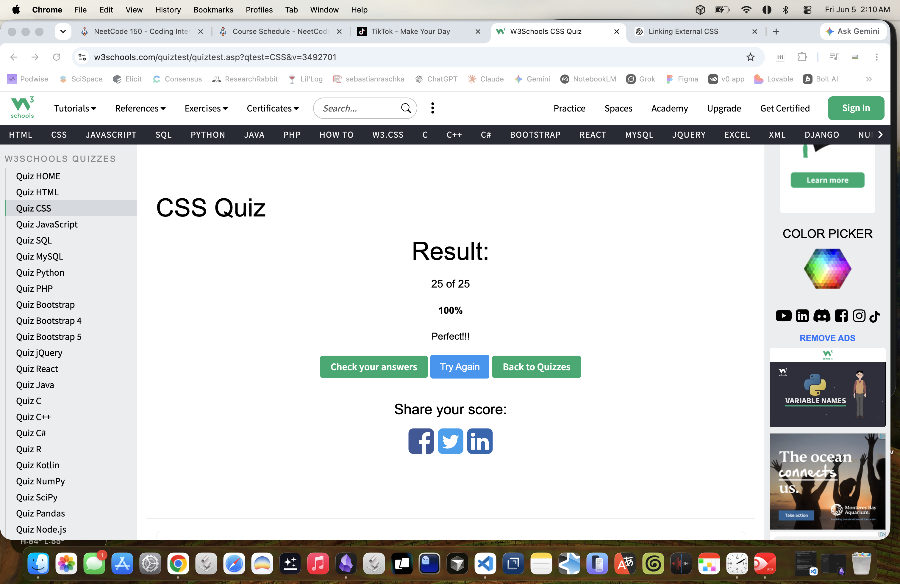

# 1. 问答练习(八股)

准备以下八股题目答案，写在 `note.md` 里

1. What is CSS?

CSS (Cascading Style Sheets) is the language used to control the appearance and layout of HTML elements on a webpage.

2. What is block element? How is it different from inline, and inline-block elements?

A block element starts on a new line and takes up the full width available by default.
Common block elements:

```
<div>
<p>
<h1>–<h6>
<section>
<article>
<ul>
<li>
```

An inline element only takes up as much width as its content needs.
An inline-block element stays on the same line like an inline element but allows width and height like a block element.

3. What is the difference between pseudo-class and pseudo-element?

A pseudo-class targets an element based on its state or position.

```
button:hover {
    background-color: blue;
}
```

A pseudo-element targets a part of an element or creates virtual content.

```
p::first-letter {
    font-size: 2em;
}
```

Only the first letter of the paragraph is styled.

```
p::before {
    content: "👉 ";
}

<p>Hello</p>

👉 Hello
```

Example with generated content.
The arrow wasn't in the HTML; CSS created it.

4. What is the difference between the child combinator and the descendant combinator?

Both are CSS selectors used to target elements based on their relationship in the HTML hierarchy.

Descendant Combinator ( )
A space between selectors means:
Select all matching descendants, no matter how deeply nested.

```
div p {
    color: blue;
}
```

Child Combinator (>)
A greater-than sign means:
Select only direct children.

```
div > p {
    color: red;
}
```

5. What is the attribute selector? Give some examples.

An attribute selector lets you select HTML elements based on their attributes or attribute values.
Instead of selecting by tag, class, or ID, you select elements that contain a specific attribute.

```
input[type] {
    border: 1px solid blue;
}

<input type="text">
<input type="password">
<input>
```

6. What are two ways that we can make an element invisible? What is the difference?

display: none
The element is completely removed from the page layout.

visibility: hidde
The element is invisible, but it still occupies space in the layout.

7. What is the CSS Box Model? Describe each part.

Every HTML element is treated as a rectangular box by the browser. The CSS Box Model describes how the size and spacing of that box are calculated.

```
+---------------------------+
|         Margin            |
|  +---------------------+  |
|  |      Border         |  |
|  |  +---------------+  |  |
|  |  |    Padding    |  |  |
|  |  | +-----------+ |  |  |
|  |  | | Content   | |  |  |
|  |  | +-----------+ |  |  |
|  |  +---------------+  |  |
|  +---------------------+  |
+---------------------------+
```

Content = Item inside the box
Padding = Bubble wrap
Border = Cardboard box
Margin = Empty space between packages

8. What is the usage of !important? What are some use cases?

!important is used to give a CSS declaration the highest priority, overriding most other CSS rules.
Even if another rule would normally win due to specificity or source order, the !important declaration takes precedence.

common use cases:
Overriding Third-Party Library Styles

9. What does z-index do?

z-index controls the stacking order of overlapping elements along the z-axis (depth).
Think of it as deciding which element appears in front of or behind another element.

```
.box1 {
    position: absolute;
    z-index: 1;
}

.box2 {
    position: absolute;
    z-index: 2;
}
```

10. Can padding and margin be negative?

Margin: Yes, can be negative
Padding: No, cannot be negative

11. How do you center a block element with CSS?

In modern CSS, Flexbox (justify-content: center) or Grid (place-items: center) are also commonly used, especially when both horizontal and vertical centering are needed.

```
.container {
    display: flex;
    justify-content: center; /* horizontal */
    align-items: center;     /* vertical */
    height: 100vh;
}
```

// Flexbox

```
.container {
    display: grid;
    place-items: center;
}
```

// Gird

12. What are grid items? Can you explain some grid item properties?

In CSS Grid, a grid container is an element with:

```
.container {
    display: grid;
}
```

All of its direct children automatically become grid items.

Common grid item properties include grid-column and grid-row for controlling how many rows or columns an item spans, grid-area as a shorthand for placement, and justify-self and align-self for aligning an item within its grid cell. These properties allow precise control over an item's position and size inside the grid layout.

13. What is a flex container? Can you explain some flex container properties?

A flex container is an element with:

```
.container {
    display: flex;
}
```

When an element becomes a flex container, all of its direct children become flex items.

Common flex container properties include:
flex-direction to define the layout direction.
justify-content to align items along the main axis.
align-items to align items along the cross axis.
flex-wrap to control wrapping.
gap to add spacing between items.

14. What is responsive web design? How do we achieve this?

Responsive Web Design (RWD) is an approach to web development where a website automatically adapts its layout and appearance to different screen sizes and devices.

It is typically achieved using the viewport meta tag, CSS media queries, flexible layouts such as Flexbox and Grid, relative sizing units, and responsive images.

```
<meta name="viewport" content="width=device-width, initial-scale=1.0">
```

```
/* Desktop */
.container {
    display: flex;
}

/* Mobile */
@media (max-width: 768px) {
    .container {
        flex-direction: column;
    }
}
```

```
.container {
    display: flex;
    flex-wrap: wrap;
}

.container {
    display: grid;
    grid-template-columns: repeat(auto-fit, minmax(250px, 1fr));
}
```

# 2. Quiz


